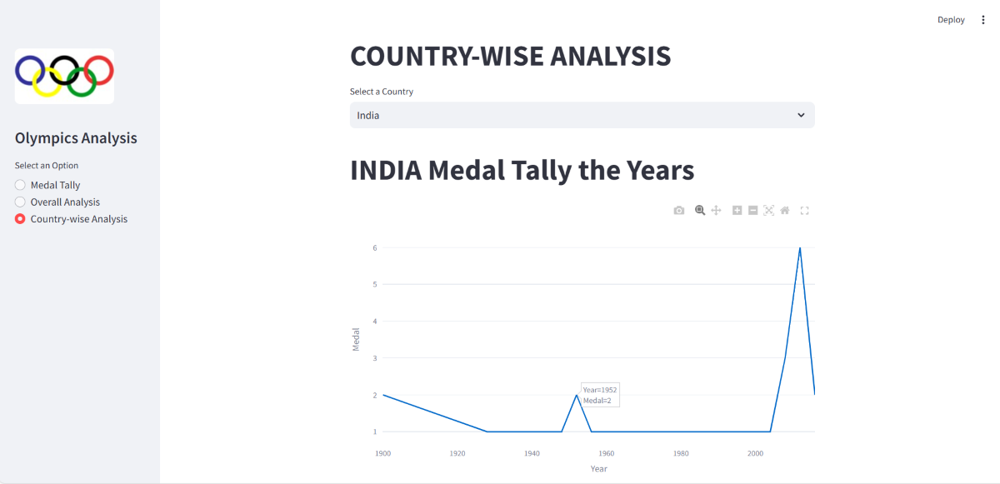

# OLYMPICS DATA ANALYSIS



Welcome to the **Olympics Data Analysis project!** This is my **first Python project**, developed during my **third semester**, focusing on comprehensive data analysis and visualization of historical Olympic data. The project leverages powerful Python libraries such as **Pandas** for data manipulation and **Plotly, Seaborn, and Matplotlib** for creating insightful and interactive visualizations.

The core of this project is a **Streamlit web application** that allows users to interactively explore various analyses. For this project, we primarily focus on **Summer Olympics data**, encompassing 120 years of history from 1896 to 2016.

What's included?

1) **Medal Tally Analysis**

    -> year-wise

    -> country-wise

    -> overall

2) **Overall Analysis**

    -> includes useful maps

3) **Country-wise Analysis**

    -> mainly includes charts and useful insights

First we will need to collect data about the movies for this use **120 years of Olympic history: athletes and results** [Visit Dataset](https://www.kaggle.com/datasets/heesoo37/120-years-of-olympic-history-athletes-and-results "Download or get more information about the dataset"). The project development workflow is structured into three main phases: data collection, data preprocessing, and web application creation. **data collection, data preprocessing, and creating website**.


## Installations

1. Clone the repo:
   ```sh
   git clone https://github.com/jainamb12/olympic-data-analysis.git
   ```
2. Install the required packages:
   ```sh
   pip install numpy pandas streamlit matplotlib seaborn plotly
   ```
3. Run the project using command:
   ```sh
   streamlit run app.py
   ``` 
   **NOTE** : In case the above command doesn't work, try running the file by giving absolute file path in your terminal:


## Logic

The analytical engine processes the Olympic data through these key steps:

1. **Initial Data Filtering**:
The dataset is initially filtered to include only **Summer Olympics** records, removing all "Winter" season entries.

2. **Data Merging**:
The athlete_events.csv and noc_regions.csv datasets are merged using the NOC (National Olympic Committee) column to consolidate athlete and region information.

3. **Data Preprocessing and Medal Aggregation**:
The dataset undergoes thorough cleaning and preprocessing.
One-Hot Encoding (OHE) is applied to the Medal column to create binary indicators for Gold, Silver, and Bronze.
A direct group by NOC and summing of medals would incorrectly count multiple medals for team events (e.g., 11 gold medals for a hockey team win). To correct this, duplicate rows based on a combination of Team, NOC, Games, Year, City, Sport, Event, and Medal are dropped before aggregation. This ensures each unique medal won by a team/athlete for an event is counted only once.
After correction, medals are then grouped and aggregated.

4. **Flexible Data Filtering**:
A dedicated helper function is implemented to manage four different cases of filtering the dataset by country and year, ensuring dynamic and precise analysis.

Note: Due to historical and geographical changes (e.g., in countries like Russia, Germany), results in some analyses might show slight variations compared to current official records.

5. **Overall Analysis Implementation**:
This section begins by presenting top-level statistics, derived from unique counts within specific columns, followed by the generation of various plots and geographical maps for comprehensive insights.

6. **Country-wise Analysis Implementation**:
For individual country analysis, a dedicated plot visualizes its medal tally over time, and a map highlights the sports in which that country excels.


## Features
1. User Input selection for preferences
2. Attractive UI using Streamlit
3. charts and maps for better visualisation
4. manages data properly for each analysis
5. Deployed on **streamlit cloud** for easy access


## Contributing
Contributions are welcome! Follow these steps:
1. Fork the project.
2. Create a new branch (`git checkout -b feature-branch`).
3. Commit your changes (`git commit -m 'Add feature'`).
4. Push to the branch (`git push origin feature-branch`).
5. Open a pull request.
